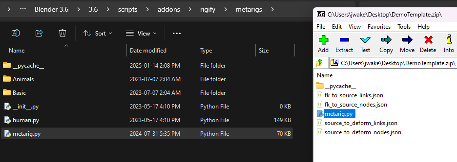
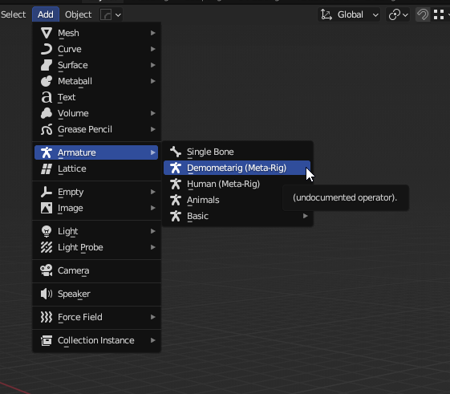
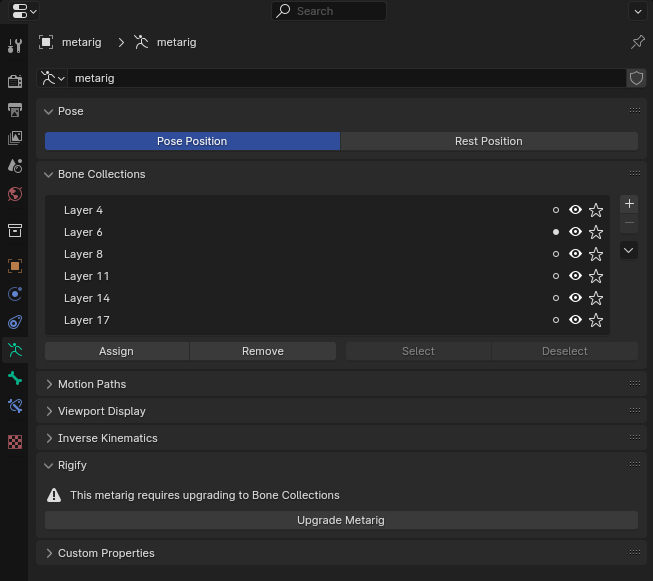
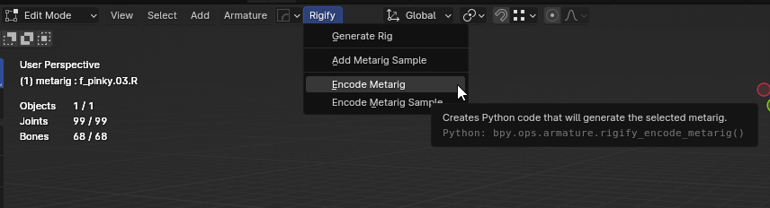
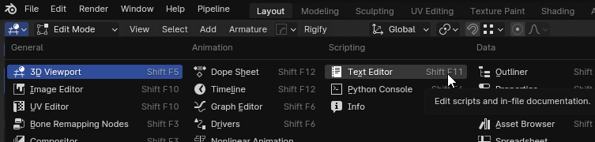
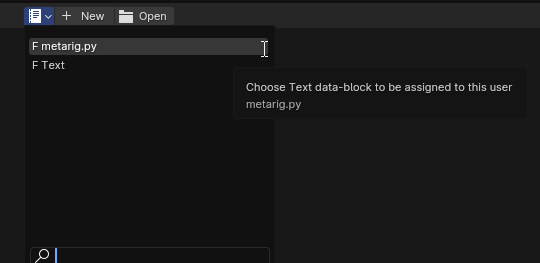
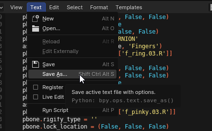
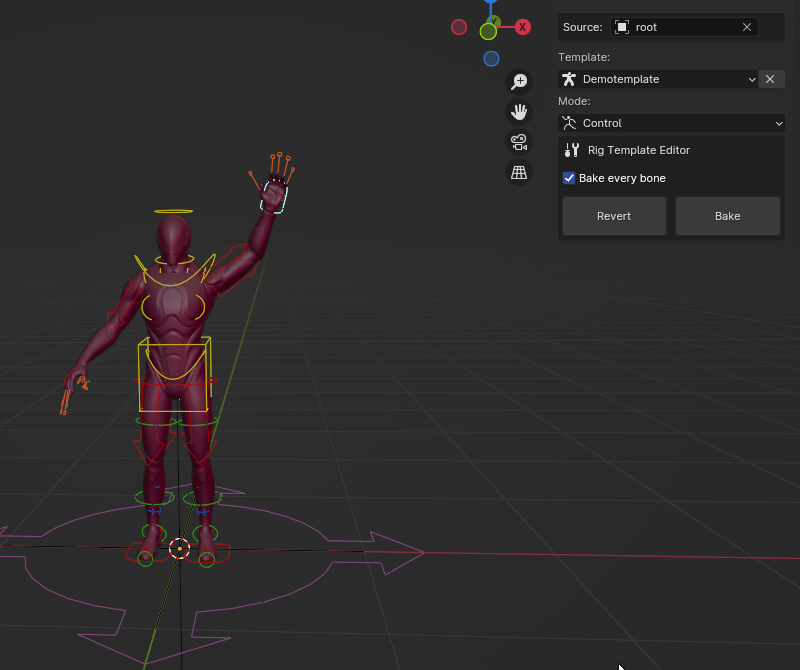

# FAQ

### How can I share a template I created with another artist?
Go to Edit > Preferences > Addons > UE to Rigify and select ‘Export Template’. From the sidebar in the file window
select the template you want to export. Then select the location on your hard drive and click `Export Template`.
They can now click ‘Import Template’ and select this file, then click ‘Import Template’.

### How can I use a Rigify metarig as the source rig?
If you want to use the tool to drive a rig you made in blender that is a Rigify metarig template, you need to rename
it. You should stay away from the names "metarig" and "rig" because those are Rigify reserved names and when UE to
Rigify generates a new rigify rig, those could get stomped on. Thus, renaming the metarig you added as your source
rig is necessary for this to work.

## Where are Rig templates stored?
Default location for Rig templates if a custom location hasn't been set:
- windows: `%TEMP%\ue2rigify\resources\rig_templates`
- unix: `/tmp/ue2rigify/resources/rig_templates`

## How do I update a metarig made in Blender 3.6 for use in 4.0+?
Since Blender 4.0 removed Bone Layers, Rigify had to change the generated template which causes an error when importing your  UE2Rigify template.

However there is a solution built into Rigify that can update the metarig when you load a 3.6 Blend file in Blender 4+. Here's how you can update your template:

>Requires Blender 3.6

1. Open your exported template zip file and extract the metarig.py file to the following location in your Blender 3.6 install:

`C:\Program Files\Blender Foundation\Blender 3.6\3.6\scripts\addons\rigify\metarigs`

2. Rename metarig.py to something recognizable i.e.
`demometarig.py`

3. Open Blender 3.6 and add your metarig to the scene

4. Create a new save, close Blender 3.6, and open the new save in Blender 4+

5. Select the rig and open the Armature data tab. You should see Rigify tell you it needs to update to Collections. Click `Upgrade Metarig`

6. Switch to Edit Mode with the armature still selected. A Rigify menu should appear at the top. Click `Rigify > Encode Metarig`

7. Switch your Viewport to Text Editor and open the new metarig.py

8. Save the file to Desktop keeping the name as `metarig.py` and replace the metarig file in your template zip with the new one.

9. Before attempting to import your template again, **you must delete the previous attempt from UE2Rigify's templates folder.** Default location can be found above.

10. Restart Blender 4+ and import your template. It should now work as intended!

